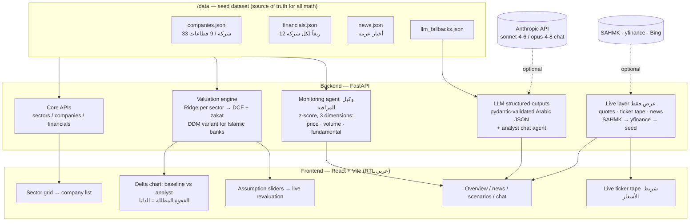

# دلتا — Delta

**منصة أبحاث الأسهم التوليدية للسوق السعودية (تداول)**
*Generative AI equity research platform for the Saudi Exchange (Tadawul)*

### 🔴 عرض مباشر — Live demo: **<https://delta-tadawul.vercel.app>**
*(عرض مفتوح بدون تسجيل دخول — open public demo, no login required)*

يبني النموذج الآلي توقعاً أساسياً لكل شركة، ويعدّل المحلل الفرضيات — والفجوة
المظللة بين الخطّين هي **الدلتا**: جوهر المنتج. وكيل مراقبة يرصد السلوك المالي
غير الاعتيادي تلقائياً، ونماذج لغوية تولّد النبذات والسيناريوهات بالعربية، مع
أسعار سوق مباشرة وأخبار حية.

The ML engine builds a baseline forecast per company; the analyst adjusts
assumptions and the shaded gap between the two lines is **the Delta**. A
monitoring agent flags anomalous financials automatically; LLM features
generate Arabic overviews, news summaries, an analyst chat, and
bull/bear/thesis-breaker cards — layered on top of **live market prices and
live news**.

---

## التشغيل — Quick start

Prerequisites: Python 3.12+, Node 20+.

```bash
# 1. Install (once)
cd backend  && python -m venv .venv && .venv/Scripts/python -m pip install -r requirements.txt && cd ..
cd frontend && npm install && cd ..

# 2. Run both servers
make dev            # Linux/macOS/Git-Bash with make
./dev.ps1           # Windows PowerShell (no make needed)
```

- Backend: <http://127.0.0.1:8000> (docs at `/docs`)
- Frontend: <http://localhost:5173>

```bash
make test           # backend test suite (88 tests)
```

### مفاتيح البيئة — Environment keys (both optional)

Put them in `backend/.env` (gitignored). **The demo runs fully without either** —
every external layer degrades gracefully to the offline seed dataset.

| Variable | Enables | Fallback when unset |
|----------|---------|---------------------|
| `ANTHROPIC_API_KEY` | LLM generation — overview, news summary, scenarios, analyst chat | Schema-identical cached outputs in [data/llm_fallbacks.json](data/llm_fallbacks.json), formatted with the real valuation numbers |
| `SAHMK_API_KEY` | Live Tadawul quotes + TASI market summary (SAHMK, Tadawul-licensed) | yfinance, then the seed price |

> ⚠️ SAHMK's **free tier is 60 requests/day**. The live badge and TASI widget use
> it sparingly; the ticker tape uses yfinance (one batched call, no daily cap).

## البيانات — Seed data

Deterministic synthetic dataset — 33 Tadawul companies, 9 sectors, 12 quarters
each, 4 deliberately embedded anomalies. **All valuation math runs on this seed
data only**, so every number is reproducible; live prices and news are a
display-only overlay. Regenerate with:

```bash
backend/.venv/Scripts/python data/generate_seed.py
backend/.venv/Scripts/python data/calibrate_prices.py
backend/.venv/Scripts/python data/validate_seed.py
```

## المعمارية — Architecture



## الخصوصية السعودية — Saudi-first design

- واجهة عربية كاملة بتخطيط RTL وخط IBM Plex Sans Arabic.
- **الزكاة** (٢٫٥٪ من الوعاء التقريبي) بند صريح في التقييم، لا "ضريبة" عامة.
- **الصكوك** مفصولة عن الدين التقليدي في القوائم والتفصيل.
- **المصارف الإسلامية** لها نموذج خاص: دخل تمويل (لا فوائد) وتقييم بنمط توزيعات.

## النشر — Deployment

Deployed to **Vercel** (free Hobby tier): the frontend builds to static assets and
the FastAPI backend runs as a Python serverless function under `/api` (see
[vercel.json](vercel.json) and [api/index.py](api/index.py)). The serverless bundle
uses the root [requirements.txt](requirements.txt); API keys are set as Vercel
environment variables, not committed.

```bash
npx vercel --prod        # redeploy (CLI-based; not auto-connected to GitHub)
```

## Demo

See [docs/DEMO.md](docs/DEMO.md) for the exact presentation click path
(clean bank vs. anomaly company).
