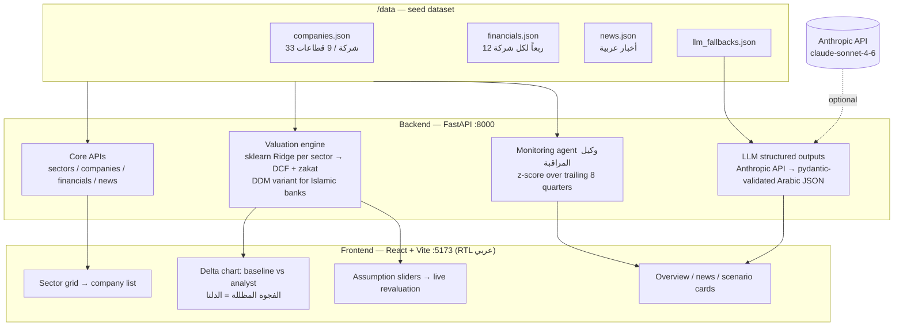

# دلتا — Delta

**منصة أبحاث الأسهم التوليدية للسوق السعودية (تداول)**
*Generative AI equity research platform for the Saudi Exchange (Tadawul)*

يبني النموذج الآلي توقعاً أساسياً لكل شركة، ويعدّل المحلل الفرضيات — والفجوة
المظللة بين الخطّين هي **الدلتا**: جوهر المنتج. وكيل مراقبة يرصد السلوك المالي
غير الاعتيادي تلقائياً، ونماذج لغوية تولّد النبذات والسيناريوهات بالعربية.

The ML engine builds a baseline forecast per company; the analyst adjusts
assumptions and the shaded gap between the two lines is **the Delta**. A
monitoring agent flags anomalous financials automatically; LLM features
generate Arabic overviews, news summaries, and bull/bear/thesis-breaker cards.

---

## التشغيل — Quick start

Prerequisites: Python 3.12+, Node 20+.

```bash
# 1. Install (once)
cd backend  && python -m venv .venv && .venv/Scripts/python -m pip install -r requirements.txt && cd ..
cd frontend && npm install && cd ..

# 2. Run both servers
make dev            # Linux/macOS/Git-Bash with make
./dev.ps1           # Windows PowerShell (no make needed)
```

- Backend: <http://localhost:8000> (docs at `/docs`)
- Frontend: <http://localhost:5173>

**LLM (اختياري / optional):** set `ANTHROPIC_API_KEY` before starting the backend
to enable live generation (model `claude-sonnet-4-6`). **Without a key the demo
still works fully** — schema-identical cached fallbacks in
[data/llm_fallbacks.json](data/llm_fallbacks.json) are formatted with the real
valuation numbers at runtime.

```bash
make test           # backend test suite (31 tests)
```

## البيانات — Seed data

Deterministic synthetic dataset — 33 Tadawul companies, 9 sectors, 12 quarters
each, 4 deliberately embedded anomalies. Regenerate with:

```bash
backend/.venv/Scripts/python data/generate_seed.py
backend/.venv/Scripts/python data/calibrate_prices.py
backend/.venv/Scripts/python data/validate_seed.py
```

## المعمارية — Architecture



## الخصوصية السعودية — Saudi-first design

- واجهة عربية كاملة بتخطيط RTL وخط IBM Plex Sans Arabic.
- **الزكاة** (٢٫٥٪ من الوعاء التقريبي) بند صريح في التقييم، لا "ضريبة" عامة.
- **الصكوك** مفصولة عن الدين التقليدي في القوائم والتفصيل.
- **المصارف الإسلامية** لها نموذج خاص: دخل تمويل (لا فوائد) وتقييم بنمط توزيعات.

## Demo

See [docs/DEMO.md](docs/DEMO.md) for the exact presentation click path
(clean bank vs. anomaly company).
